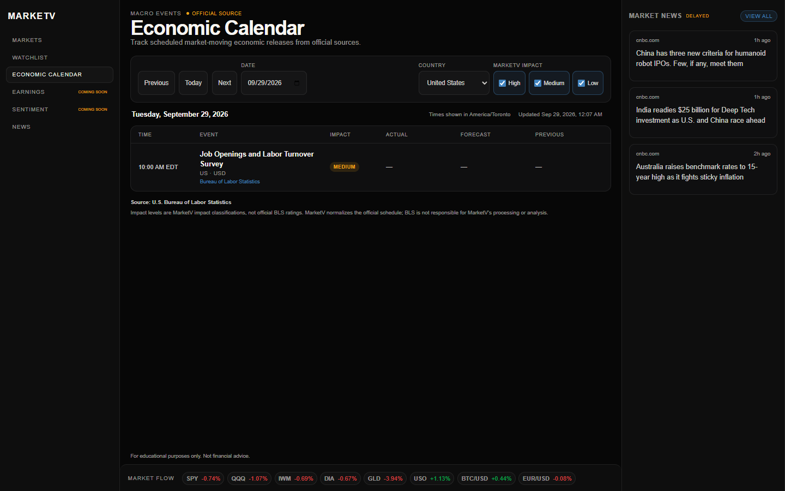
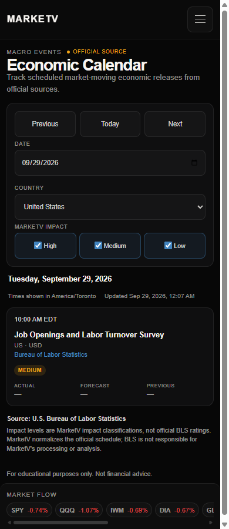

# MarketV

A responsive financial-market dashboard built with Flask, PostgreSQL,
and vanilla JavaScript. MarketV combines market data, interactive charts,
financial news, visitor-specific watchlists, and an official-source U.S.
economic calendar.

**[Open MarketV](https://marketv.onrender.com)**
## Screenshots

### Desktop



### Mobile



## Current functionality

- Responsive Markets and Watchlist workspaces for desktop, tablet, and mobile
- Batched Twelve Data quotes for U.S. equities, index ETFs, GLD, USO, Bitcoin, and EUR/USD
- Cached quote, intraday, and historical-price requests
- Selected-instrument details with range controls and SVG price-history charts
- Five-day search-result sparklines and one-day card sparklines
- Anonymous watchlists scoped to a secure browser cookie
- Market Flow strip shared across every page
- Curated Marketaux news with delayed-data and heuristic importance labels
- Official Bureau of Labor Statistics release schedule with date, country, and MarketV impact filters
- Accessible mobile navigation, keyboard focus states, and reduced-motion support
- Explicit loading, empty, delayed, stale, and unavailable states

Earnings and Sentiment are intentionally marked **Coming Soon**. Their navigation entries remain visible so the product roadmap is clear without presenting placeholder data as complete functionality.

## Architecture

```text
Browser
  ├─ Flask-rendered pages and static JavaScript modules
  ├─ /api/quotes and /api/history → cached market-data service → Twelve Data
  ├─ /api/economic-calendar → calendar service → PostgreSQL cache → official BLS feed
  ├─ /news → server-side Marketaux client
  └─ /watchlist → visitor cookie → watchlist service → PostgreSQL

Production
  GitHub → GitHub Actions → Render web service → Neon PostgreSQL
```

Provider code stays on the Flask server. API keys and database credentials are never sent to the browser. The economic-calendar service uses a replaceable provider interface so another official source can be added without rewriting the UI.

### Market-data caching

`services/market_data.py` coordinates a server-side Twelve Data adapter with thread-safe, process-local caches and refresh locks:

- Quotes remain fresh for 15 minutes and may fall back to cached data for six hours.
- Historical and intraday series remain fresh for six hours and may fall back for 24 hours.
- Failed refreshes are held briefly so multiple visitors cannot repeatedly hit the provider.
- Provider calls contain no more than eight symbols and a local rolling budget protects the free plan's eight-credit-per-minute and 800-credit-per-day limits.

Render initially runs one Gunicorn worker with four threads so all requests share the same in-memory caches while network-bound provider calls can overlap. A 120-second worker timeout allows for occasional slow upstream responses.

### Visitor-specific watchlists

MarketV assigns an anonymous random identifier in an HTTP-only, `SameSite=Lax` cookie. Production cookies are also `Secure`. Watchlist rows are isolated by that identifier, but they are not authenticated user accounts. Clearing browser cookies loses access to the corresponding watchlist.

### Economic-calendar design

The calendar ingests the official BLS release schedule, normalizes it through a provider adapter, and stores successful results in PostgreSQL. Cached database results provide a stale-data fallback when the official feed is temporarily unavailable. Event times are converted to the browser's local timezone.

BLS supplies the release schedule. BLS does **not** supply MarketV's high, medium, and low impact labels; those are transparent, application-generated classifications. Actual, forecast, and previous values remain unavailable unless a future provider supplies them.

## Technology stack

- Python 3.12 and Flask
- PostgreSQL locally or Neon PostgreSQL in production
- psycopg2 for database access
- Twelve Data for server-side quote and historical market data
- Marketaux for financial news
- Official BLS calendar feeds
- Vanilla JavaScript, HTML, CSS, and SVG charts
- Gunicorn for production serving
- Python `unittest` and Node's built-in test runner
- GitHub Actions for continuous integration
- Render for free-tier web hosting

## Security measures

- Provider keys and database credentials remain server-side environment variables.
- Hosted database connections require SSL unless the connection string already specifies its own SSL mode.
- External news content is rendered with `textContent`; article links are restricted to HTTP(S).
- Visitor cookies are HTTP-only, `SameSite=Lax`, and secure in production.
- Flask trusts one layer of Render proxy headers in production so HTTPS is detected correctly.
- Client-facing provider errors are generic, while structured server logs retain provider and error-type context without logging credentials or full database URLs.
- The `/health` endpoint performs no database or external-provider calls.

## Local installation

### Prerequisites

- Python 3.12+
- PostgreSQL
- Node.js 22+ for JavaScript tests
- IntelliJ IDEA or another editor

On Windows PowerShell:

```powershell
git clone https://github.com/JDN099/market-dashboard.git
cd market-dashboard
py -3.12 -m venv .venv
.\.venv\Scripts\Activate.ps1
python -m pip install --upgrade pip
python -m pip install -r requirements.txt
Copy-Item .env.example .env
```

Create a local PostgreSQL database, then update only your untracked `.env` file:

```text
DB_NAME=market_dashboard
DB_USER=postgres
DB_PASSWORD=your_local_password
DB_HOST=localhost
DB_PORT=5432
TWELVE_DATA_API_KEY=your_twelve_data_key
```

Apply migrations and start Flask:

```powershell
python scripts/migrate.py
python app.py
```

Open `http://127.0.0.1:5000/markets`. Set `FLASK_DEBUG=true` only when you want local debug mode.

## Database migrations

Migrations are numbered SQL files in `migrations/`. The migration runner records applied versions in `schema_migrations` and uses a PostgreSQL advisory lock so only one runner changes the schema at a time.

```powershell
python scripts/migrate.py
```

- `001_create_visitor_watchlist.sql` creates visitor-scoped watchlists.
- `002_create_economic_calendar.sql` creates calendar event and provider-state storage.

To validate every migration against a temporary schema in your configured PostgreSQL database without keeping any test tables:

```powershell
python scripts/validate_migrations.py
```

## Tests

The automated tests use fixtures and mocks. They do not require live Twelve Data, Marketaux, BLS, Neon, or Render access.

```powershell
py -3.12 -B -m unittest discover -s tests -p "test_*.py" -v
node scripts/run_javascript_tests.cjs
Get-ChildItem static -Filter *.js | ForEach-Object { node --check $_.FullName }
git diff --check
```

For local browser viewport verification, start Chrome or Edge with a temporary remote-debugging profile on port `9223`, then run:

```powershell
node scripts/viewport_check.mjs http://127.0.0.1:5000
```

The script checks every page at 320, 375, 390, 768, 1024, and 1440 pixels and refreshes the screenshots in `docs/screenshots/`.

CI runs the same Python tests, Node tests, JavaScript syntax checks, Python compilation, and whitespace validation on pushes and pull requests.


## Data sources and limitations

- Market prices and charts come from Twelve Data through a server-only API integration. MarketV intentionally caches quotes for at least 15 minutes, so displayed values must be treated as delayed. Cached values can be marked stale when a refresh is rate-limited or unavailable.
- GLD is the SPDR Gold Shares exchange-traded fund and USO is the United States Oil Fund exchange-traded fund. They are not futures contracts or direct spot commodity prices.
- MarketV does not currently provide futures data. The free Twelve Data plan does not provide the futures coverage this project would require.
- News comes from Marketaux's free API and is delayed and quota-limited. Domain filtering favors recognizable U.S.-relevant outlets but is not an editorial guarantee.
- Calendar schedule data comes from the [U.S. Bureau of Labor Statistics](https://www.bls.gov/schedule/news_release/). MarketV's normalized output and impact classifications are not endorsed by BLS.
- Free Render services can spin down while idle, causing a cold-start delay.
- Neon free computes can scale to zero, so the first database request after inactivity can be slower.
- In-memory caches are per process and are lost during deployments or restarts.
- A cold process can spend all eight minute credits loading quotes. Intraday charts may temporarily show a rate-limited state and retry once after the next credit window; successful history remains cached for several hours afterward.
- Anonymous cookie-based watchlists do not sync across browsers or devices.
- MarketV does not yet provide authenticated accounts, trade execution, portfolio accounting, earnings data, or a finished sentiment model.

## Roadmap

- Complete the Earnings calendar
- Build a transparent multi-factor Sentiment page
- Add more official economic-data providers behind the existing interface
- Add authenticated accounts
- Add richer browser-based accessibility and visual-regression coverage

## Educational-use disclaimer

MarketV is an educational portfolio project. Information may be delayed, stale, incomplete, or incorrect. Nothing in this application is financial advice, a recommendation, or an offer to buy or sell any security or financial instrument.

Market data provided by [Twelve Data](https://twelvedata.com/). Exchange-specific attribution and usage restrictions may also apply.
